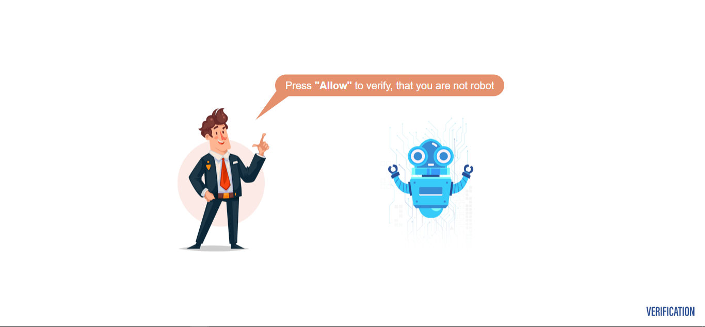

<html>

<head>
</head>
<body>

# ilo134ulih.com--SPAMs-
this is a spam page Refer to ilo134ulih.com  domain BY AWARE WITH IT ..  

 "I've been seeing that domain name, followed by various / alphamueric strings, all over the place. A search on google for the name brings up plenty of sites claiming that they can remove malware going by that name, frankly those sites sound like malware downloads themselves in most cases.

I've seen this domain coming up as about 1 in 30 of the google results I try to follow from searches, and this has been happening across multiple separate computers, all of the computers in question running NoScript in firefox ESR on debain based flavours of linux. I have not been clicking any links going to that domain, but I've found it appearing as a redirect on some google search links I have clicked. Unfortunately it has usually appeared when I've been opening a large number of links in tabs and reading them later, hence I haven't been able to record exactly what links led to it, but in general we're talking tech blogs, programming question sites (the odd super user and stack overflow link might have been redirected there) and that sort of thing. I run NoScript so the pages a this domain just come up blank, though if I view the source code I see that they have a fair bit of javascript which if I didn't have NoScript would be doing something when the pages loaded. I don't know enough about javascript to know quite what the pages would do if they could, but my attempts to research this domain name suggest that for users without NoScript these ilo134ulih pages become further redirects to spam websites."

</body>
</html

